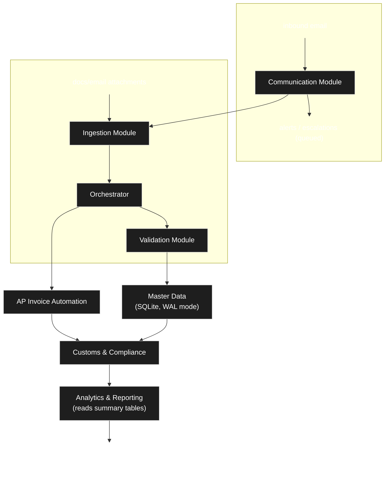

# ALE Supply Chain Management (SCM) - AI Agentic Backend

## Overview
**ALE SCM** is a next-generation enterprise Model Context Protocol (MCP) server built with **NitroStack**. It powers an autonomous AI backend capable of document ingestion (OCR), master data validation, supply chain workflow orchestration, intelligent exception handling, and interactive Next.js widgets for rich client visualization. 

By exposing native supply-chain capabilities directly to AI agents (like Claude Desktop, Cursor, or NitroStudio), it transforms traditional, rigid ERP systems into a dynamic, agentic workflow engine. 

---

## Architectural Novelty and MCP Integration

What makes ALE SCM unique is how it bridges the gap between conversational AI and strict enterprise resource planning. The platform introduces several novel architectural paradigms that elevate standard MCP capabilities.

### Dual-Transport Protocol
The server runs natively over `STDIO` for local AI clients (such as Cursor or Claude Desktop) while simultaneously exposing a robust `HTTP SSE` (Server-Sent Events) interface for remote, distributed cloud access. This allows for both secure local development and scalable enterprise deployment without code changes.

### Interactive UI Widgets (Beyond JSON)
Instead of returning raw JSON to the AI or relying on basic markdown tables, our MCP pushes interactive React/Next.js components directly into the AI's chat window. When an invoice is processed, the user sees a beautifully rendered, interactive visual breakdown of the discrepancies, bridging the gap between chat interfaces and traditional dashboards.

### Bring-Your-Own-LLM (BYO-LLM)
We leverage **OpenRouter** integration to democratize AI inference. You can swap out expensive proprietary models for highly capable open-source models (such as Llama 3 or Mixtral), enabling completely free, unlimited AI OCR and document data extraction.

### Resilient Persistence (SQLite Cloud WAL Mode)
We utilize an ultra-fast, distributed SQLite database running in Write-Ahead-Log (WAL) mode. This provides the development simplicity of local file-based databases while offering the resilience, concurrency, and distributed nature of a production PostgreSQL cluster.

### Human-in-the-Loop Orchestration
The system does not simply operate on a pass/fail binary. When the AI detects a mismatch during 3-way matching, it automatically halts the workflow, writes to an immutable exception log, and dispatches dynamic tasks to human stakeholders (e.g., `procurement_team` or `finance_team`) via a transactional email queue.

---

## Core Feature Modules

The backend is composed of highly decoupled domain modules, each responsible for a specific stage of the supply chain lifecycle.

### Ingestion Module (AI OCR)
- **Automated Parsing**: Intelligently parses PDFs, images, and raw text into structured JSON.
- **Classification**: Determines document types (Invoice, Purchase Order, Packing Slip) with high confidence before attempting data extraction.
- **Line-Item Extraction**: Extracts granular line-item data, including SKUs, quantities, and unit prices, handling messy or unstructured vendor formats.

### Master Data Module (ERP Integration)
- **Ground Truth Validation**: Instantly verifies parsed invoices against ground-truth ERP data stored in SQLite Cloud.
- **PO Lookups**: Validates the existence and status of Purchase Orders in real-time.

### Orchestrator Module (Workflow Engine)
- **Automated 3-Way Matching**: Ensures extracted invoices perfectly match Purchase Orders (PO) and Goods Receipts (GR).
- **Tolerance Rules**: Applies strict mathematical tolerance rules (e.g., 1% unit price variance or $5 total variance) before flagging an invoice.
- **Exception Routing**: Automatically escalates discrepancies to the correct department based on the failure reason.

### Compliance and Customs Module
- **Tariff Recommendations**: Recommends Harmonized System (HS) tariff codes for line item classification using predictive keyword matching, ensuring cross-border compliance.

### Communication Module
- **Resilient Queueing**: A background worker gracefully manages a resilient SQLite-backed queue.
- **Transactional Delivery**: Dispatches transactional emails (via SMTP) when exceptions are flagged or workflows require manual intervention.

### Analytics and Reporting Module
- **Executive Summaries**: Aggregates processed invoice volumes, exception rates, and processing times.
- **Immutable Audit Logging**: Maintains a strict, immutable audit log of every AI action, ensuring full traceability and compliance with enterprise security standards.

---

## System Architecture Diagram



---

## Setup & Installation

### Prerequisites
- Node.js v18 or higher
- SQLite Cloud Account
- OpenRouter API Key (For free LLM inference)

### Environment Configuration
Create a `.env` file at the root of your project:

```env
# Application Mode
NITROSTACK_APP_MODE=universal
PORT=3000

# Database
SQLITECLOUD_URL=sqlitecloud://your-project.sqlite.cloud:8860/your-db?apikey=your-api-key

# LLM Integration (OpenRouter)
OPENROUTER_API_KEY=sk-or-v1-...

# Email Configuration
SMTP_HOST=smtp.example.com
SMTP_PORT=587
SMTP_USER=user
SMTP_PASS=password
SMTP_FROM=no-reply@example.com
```

### Execution Commands
```bash
# Install dependencies
npm install

# Run database migrations and seed ERP data
npm run db:seed

# Start development server with live reload
npm run dev

# Build the production bundle
npm run build

# Start the production server
npm start
```

---

## Directory Structure
```
SCM/
├── src/
│   ├── index.ts                # Application Entry Point & MCP Factory
│   ├── modules/
│   │   ├── ingestion/          # AI Document OCR & Parsing
│   │   ├── master-data/        # SQLite ERP DB Integration
│   │   ├── orchestrator/       # Rule engines & 3-way matching
│   │   ├── communication/      # SMTP Email alerting worker
│   │   ├── ap-invoice/         # Automated AP workflows
│   │   └── analytics/          # Data aggregation and reporting
│   ├── shared/                 # LLM Clients, singletons, DI bindings & types
│   └── widgets/                # React/Next.js UI components injected into chat
├── .env.example
├── package.json
└── README.md
```

---

## Exposed MCP Tools

Clients connecting to this server have access to the following AI-native toolsets. These tools can be invoked autonomously by the LLM based on user intent.

- `ingestion_classify_document`: Intelligently determine if a document is an Invoice, PO, or Packing Slip based on raw text.
- `ingestion_extract_document_data`: Parse messy unstructured text/images into a strict, validated Zod JSON schema.
- `validate_against_master_data`: Safely query the local ERP DB for existing Purchase Orders and Vendor Details.
- `match_invoice_to_po`: Perform line-item level mathematical tolerance checks against ERP data.
- `execute_workflow`: The primary agentic entry point. Run the entire autonomous workflow end-to-end for a given invoice.
